# publicデータセットをcsvとしてGCSバケットに保存する

## DTSでの転送元になるGCSバケットを作っておく

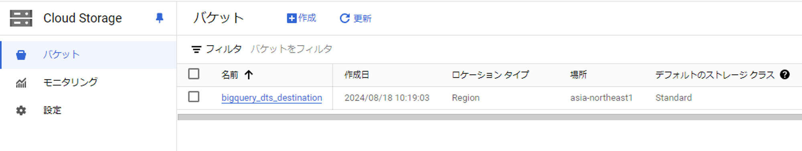

## 公開データセットを探す


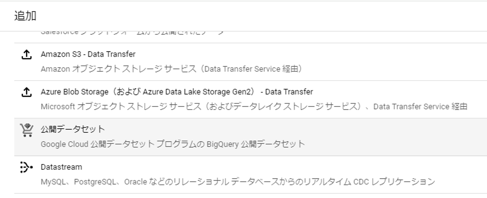

- `bigquery-public-data/new_york_subway/stations`を使ってみる

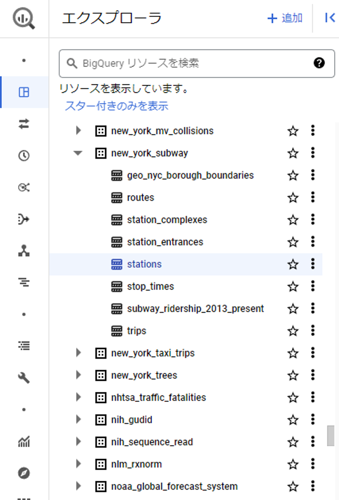

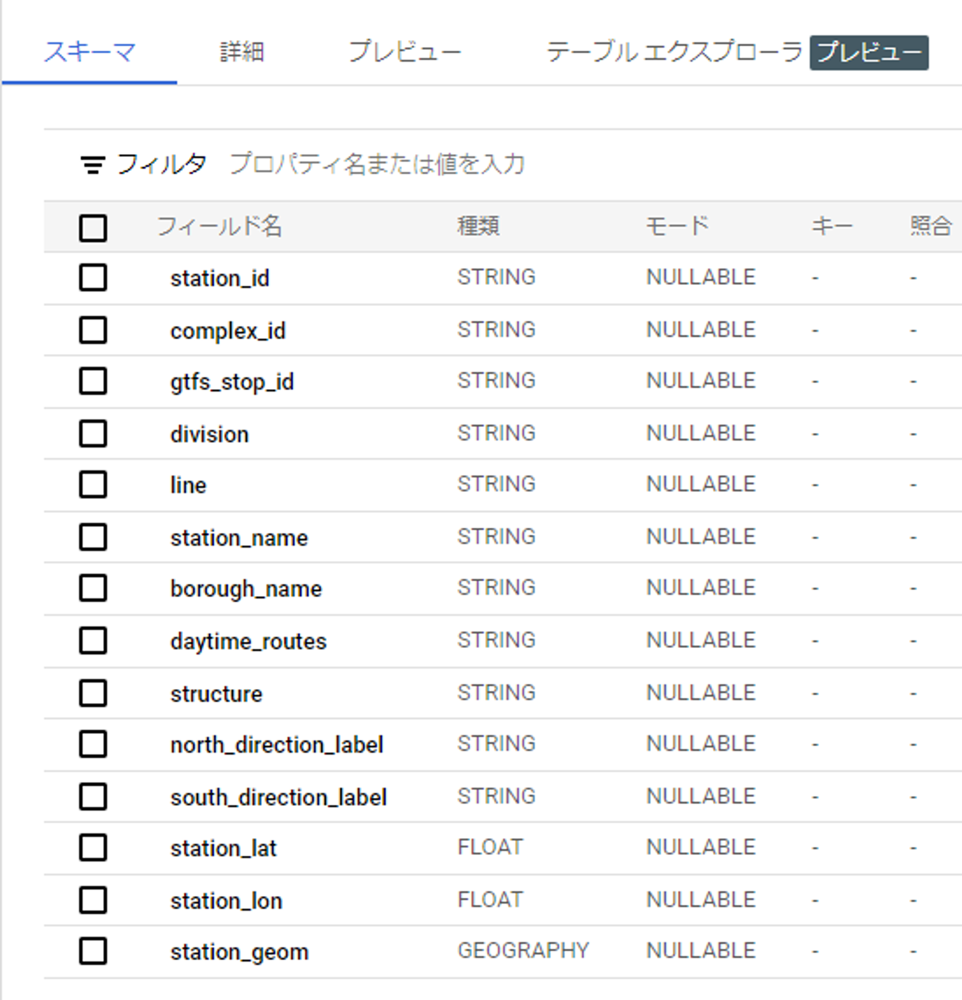

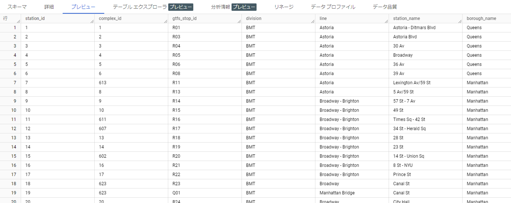

## GCSバケットにCSVファイルとしてエクスポートする

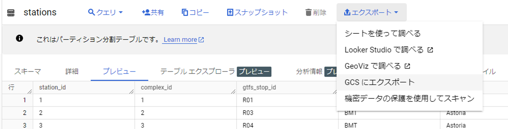

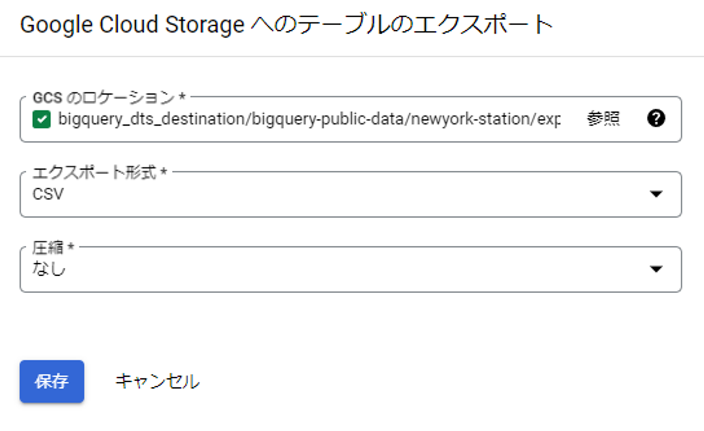

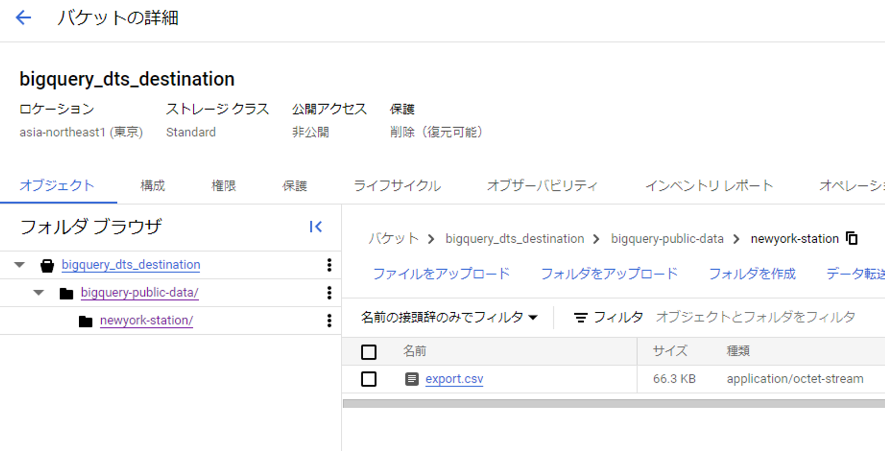

- 中身はこんな感じ、1行目にヘッダーがある

```sql
station_id,complex_id,gtfs_stop_id,division,line,station_name,borough_name,daytime_routes,structure,north_direction_label,south_direction_label,station_lat,station_lon,station_geom
1,1,R01,BMT,Astoria,Astoria - Ditmars Blvd,Queens,N W,Elevated,,Manhattan,40.775036,-73.912034,POINT(-73.912034 40.775036)
2,2,R03,BMT,Astoria,Astoria Blvd,Queens,N W,Elevated,Ditmars Blvd,Manhattan,40.770258,-73.917843,POINT(-73.917843 40.770258)
3,3,R04,BMT,Astoria,30 Av,Queens,N W,Elevated,Astoria - Ditmars Blvd,Manhattan,40.766779,-73.921479,POINT(-73.921479 40.766779)
4,4,R05,BMT,Astoria,Broadway,Queens,N W,Elevated,Astoria - Ditmars Blvd,Manhattan,40.76182,-73.925508,POINT(-73.925508 40.76182)
5,5,R06,BMT,Astoria,36 Av,Queens,N W,Elevated,Astoria - Ditmars Blvd,Manhattan,40.756804,-73.929575,POINT(-73.929575 40.756804)
6,6,R08,BMT,Astoria,39 Av,Queens,N W,Elevated,Astoria - Ditmars Blvd,Manhattan,40.752882,-73.932755,POINT(-73.932755 40.752882)
:
```

## BigQueryへのデータ転送を構築する


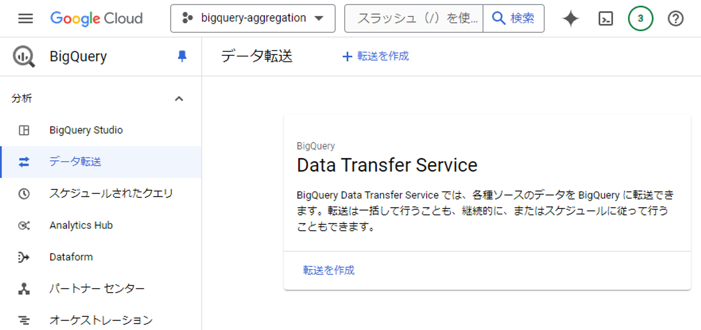


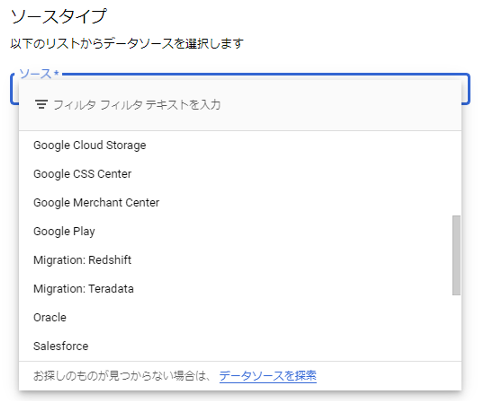


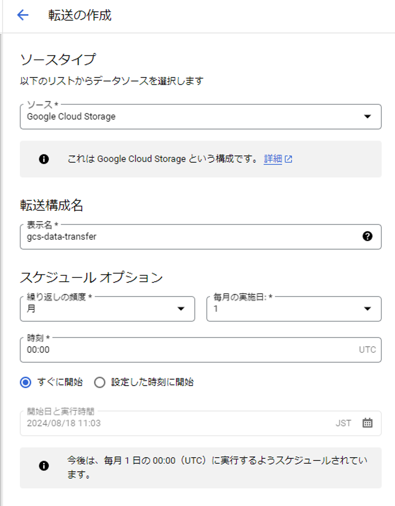

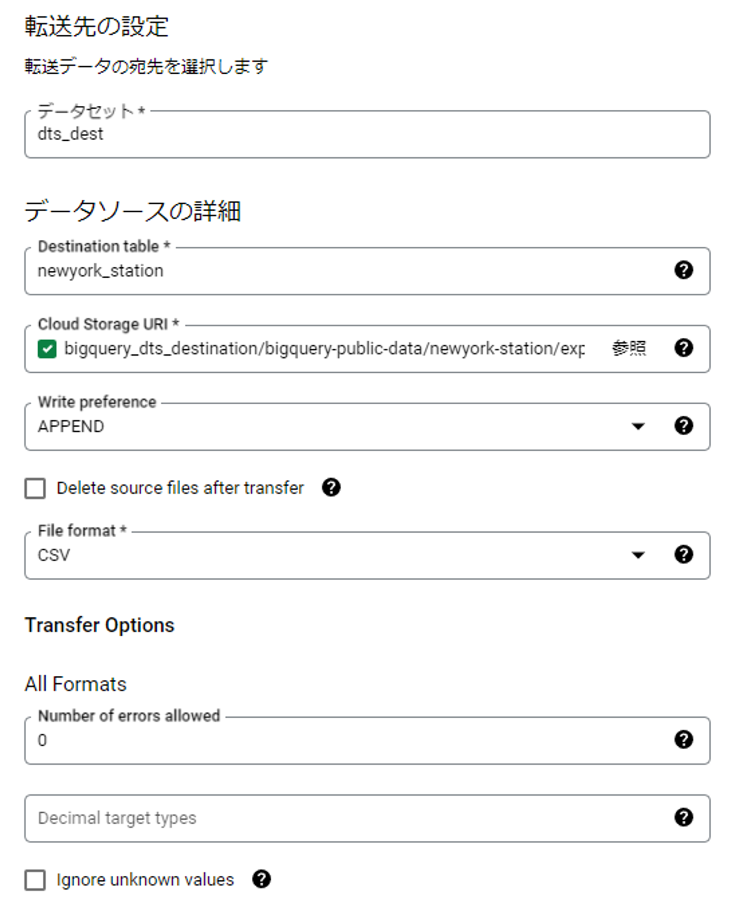

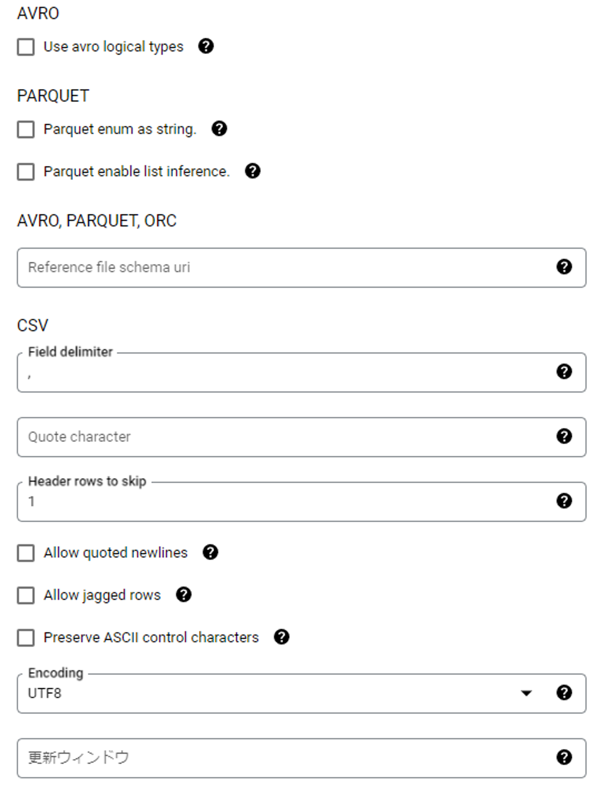


## データ転送を手動でトリガーする


- 転送先のテーブルにスキーマ定義が必要だった

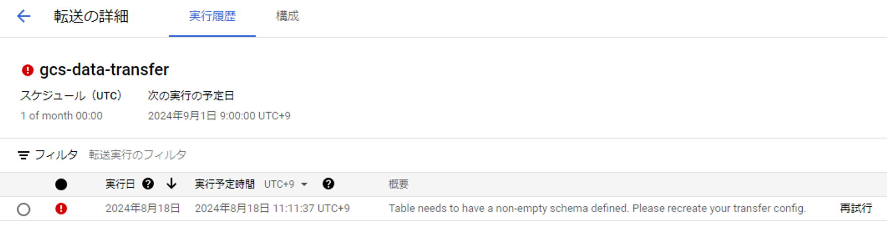

## 転送先のテーブルにスキーマを作る

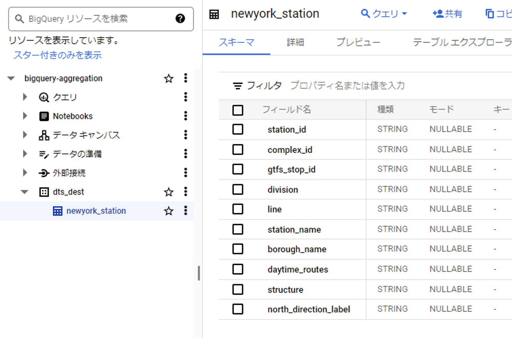

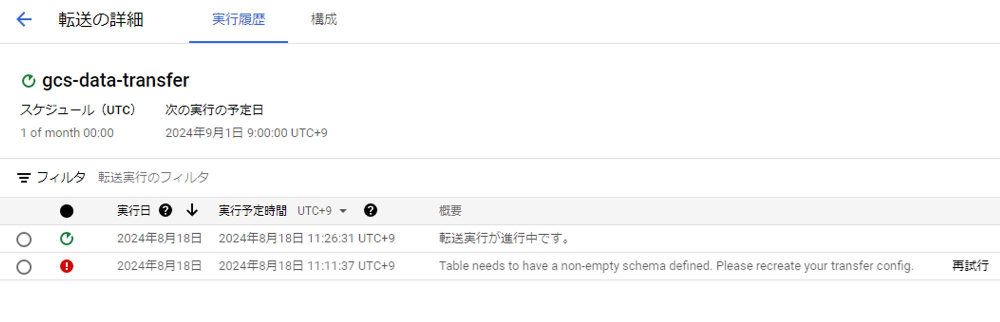

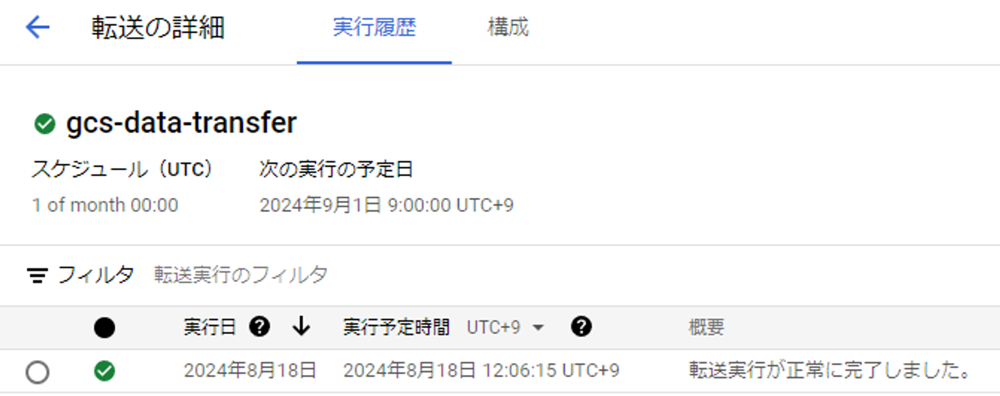

## csvからのデータ転送に成功！

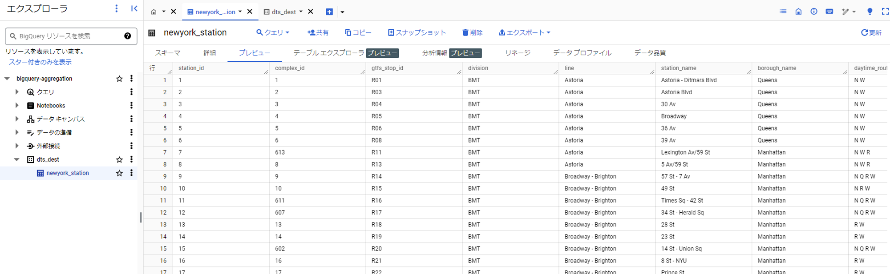

# BigQuery DTSについて

- 日時でスケジューリングされた定期的なデータ転送を行うためのサービス
- サイズの大きいファイルや大量のファイルを一括で取り込むのに適している
- GCSバケット→BigQueryの転送のようなユースケースでは無料

# 8章のまとめ

- 8.1 BigQueryへデータ集約を行うメリット
    - 分析に要求される多くの要件をBigQueryが高い水準で満たしている
- 8.2 BigQueryへのデータ集約の方法
    - バルクロード
    - ストリーミング挿入
    - 外部データソースの取り込み
    - データパイプライン
- 8.3 BigQuery DataTransferService
    - GCS、AWS S3を始め多くのデータソースからBigQueryに転送可能
    - 転送はメール通知やPub/Subトピック通知にも対応
    - 注意点あり
        - ロケーションの制約：データセットを跨ぐJOINができないため、ロケーションは統一
        - 転送コスト：転送元のプラットフォームにおいて、エクスポートに伴い発生する通信コストは要注意
- 8.4 BigQueryへのデータパイプライン構築
    - とにかくデータをBigQuery上に集約して、具体的な加工方法は後で考えるアプローチ
    - DTSによるデータ転送自体が失敗する場合はわかりやすいが、転送自体は成功扱いとなるものの意図した通りの転送になっておらず、後続の加工や利用時にそれが判明するケースには注意が必要
    - データパイプラインの規模が大きくなると依存関係の管理が複雑になりやすい
    - パイプライン自体の管理も必要
        - Dataflow + Cloud Scheduler
        - Dataflow + Cloud Composer(高額！ 💰)
- 8.5 サービス間連携によるBigQueryへのデータ連携
    - Googleアナリティクス360 → BigQuery
    - Firebase → BigQuery
- 8.6 まとめ
    - バルクロードをマイクロバッチ方式で利用するのは避けるべき
        - マイクロバッチ：小規模なバッチを高頻度に行う、リアルタイム寄りなバッチ処理
        - ファイル毎に1つのロードジョブを起動すると、BigQueryのバルクロードの性能を活かしきれない
        - バルクロードはスループットに最適化されており、大量のファイルやサイズの大きなファイルを読み込むのは得意だが、小さなファイルに高頻度で実行するユースケースには最適化されていない